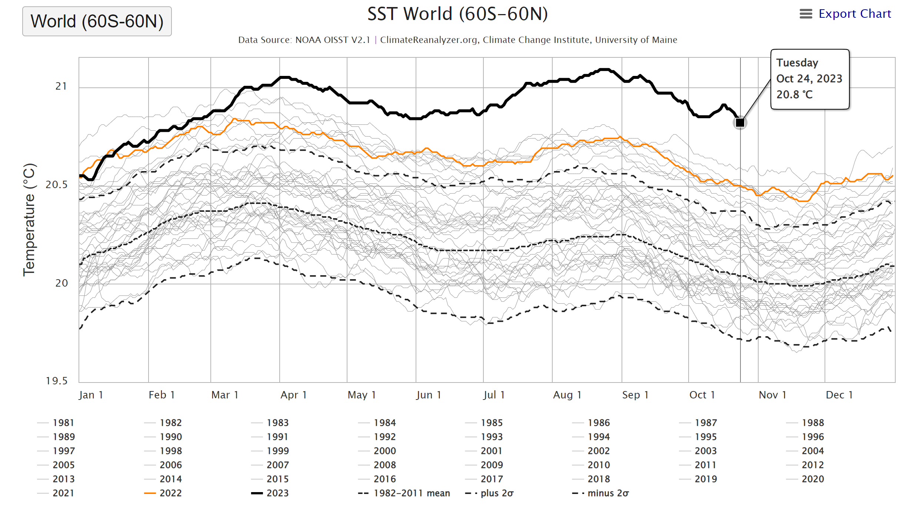
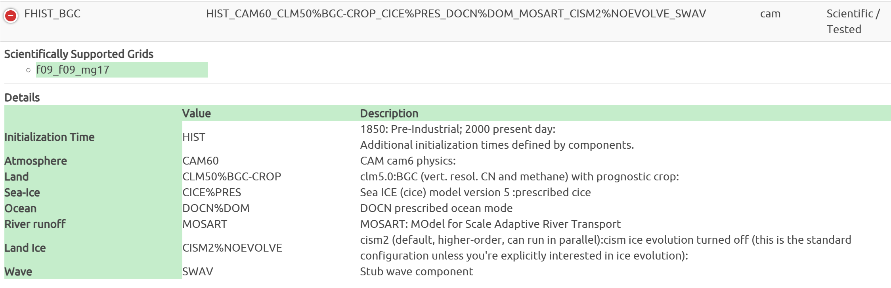

# CESM2 Tutorial  
- Learning the FHIST_BGC case in CESM2
- Case study: modifying sea surface temperature (SST) in the FHIST_BGC case

Experiment design
====

Background:
----
Global sea surface temperature (SST) is warming for the past decades. Notably, SST in year 2023 is going to be the hottest that has never been seen in the historical data (see following figure). Since this year, we witnessed several extreme events, one of those worthnoting events would be the storm *"Daniel"*, a Mediterranean tropical-like cyclone on record, leading to over 11,000 deaths in Libya [$^{[1]}$](https://news.sky.com/story/libya-floods-number-of-deaths-in-derna-could-reach-20-000-mayor-says-12960801).

Questions:
----
- What changes in climate would occur driven by 2023 extreme warm SST?

- How vegetation would be affected, response, and feedback to climate changes brought by high SST?

We might get some insights and trying to answer these questions by running an Earth System Model -- simulating the interacting processes in Earth's land and atmosphere with the input of 2023 abnormal sea surface temperature.  

In [tutorial 1](https://shijingliang.github.io/CESM2-tutorial), we learned how to set up and running a case with CESM2. But we need make modifications in the model corresponding to our experiment in order to answer our scientific questions.   

Case information
====
Details for all scientific supported cases, please refer to [CEMS2 compset definitions](https://docs.cesm.ucar.edu/models/cesm2/config/2.1.3/compsets.html): https://docs.cesm.ucar.edu/models/cesm2/config/2.1.3/compsets.html

Input data: SST forcings
====

Control experiment
====

SST2023 experiment
====

