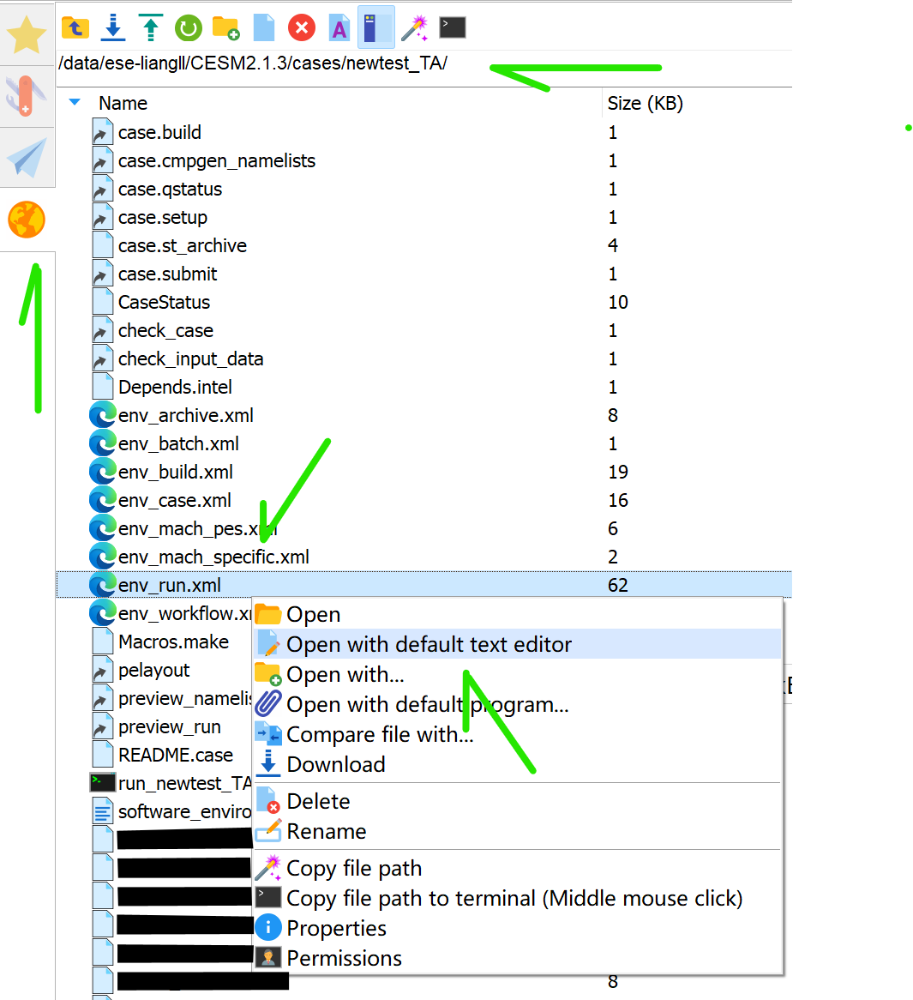
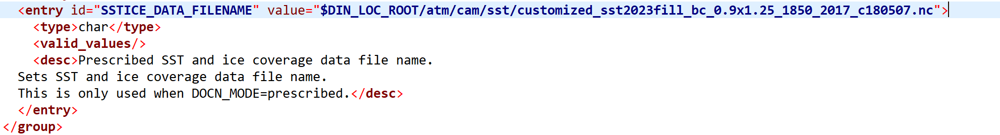

# CESM2 Tutorial  
- Learning the FHIST_BGC case in CESM2
- Case study: modifying sea surface temperature (SST) in the FHIST_BGC case

Background:
====
Global sea surface temperature (SST) is warming for the past decades. Notably, SST in year 2023 is going to be the hottest that has never been seen in the historical data (see following figure). Since this year, we witnessed several extreme events, one of those worthnoting events would be the storm *"Daniel"*, a Mediterranean tropical-like cyclone on record, leading to over 11,000 deaths in Libya [1](https://news.sky.com/story/libya-floods-number-of-deaths-in-derna-could-reach-20-000-mayor-says-12960801).

Source: [https://climatereanalyzer.org/clim/sst_daily/](https://climatereanalyzer.org/clim/sst_daily/)

Questions:
====
- What changes in climate would occur driven by 2023 extreme warm SST?

- How vegetation would be affected, response, and feedback to climate changes brought by high SST?

We might get some insights and trying to answer these questions by running an Earth System Model -- simulating the interacting processes in Earth's land and atmosphere with the input of 2023 abnormal sea surface temperature.  

In [tutorial 1](https://shijingliang.github.io/CESM2-tutorial), we learned how to set up and running a case with CESM2. But we need make modifications in the model corresponding to our experiment in order to answer our scientific questions.   

Case information
====
Details for all scientific supported cases, please refer to [CEMS2 compset definitions](https://docs.cesm.ucar.edu/models/cesm2/config/2.1.3/compsets.html): https://docs.cesm.ucar.edu/models/cesm2/config/2.1.3/compsets.html

Input data: SST forcings
====
Look up for variables defined in [CAM6.0 Namelist Definitions](https://docs.cesm.ucar.edu/models/cesm2/settings/2.1.3/cam_nml.html)  
Link: https://docs.cesm.ucar.edu/models/cesm2/settings/2.1.3/cam_nml.html

|**Variable**|**Category**|**Entry Type**|
|---|---|---|
|bndtvs|ocn|char*256|

> - Full pathname of time-variant sea-surface temperature and sea-ice
concentration boundary dataset.
> - Default: set by build-namelist.
> - For example, /data/ese-liangll/CESM2.1.3/inputdata/atm/cam/sst/sst_HadOIBl_bc_0.9x1.25_1850_2017_c180507.nc

Variable "bndtvs" is set by build-namelist, meaning that this variable is associated with the case.build process and should be modified before case.build process. "bndtvs" is specified in env_run.xml file (see below).

Experiment design
====

We have already created the input data (aka forcings) for the experiment. Here we run two simulations: (1) replacing the data-driven ocean (docn) with the observed SSTs at the year 2000 as forcing (looping over 2000 SSTs during the whole model running period), which is defined as the control simulation here; (2) replacing the docn with the obserbed SSTs at the year 2023 as forcing. Later, by comparing the (2) with (1), we shall get the results orginitated from soely changes in SSTs. 

Modify SST forcings  
====

- Create the FHIST_BGC case (mentioned in [tutorial 1](https://shijingliang.github.io/CESM2-tutorial))
- Go to /data/ese-liangll/CESM2.1.3/cases/newtest_TA/
- Right click env_run.xml
- Chose "Open with default text editor"

Note: replacing the "newtest_TA" with your new case name.

> Note: Either typing "vi env_run.xml" in command line or using mobaXterm default test editor is okay here. Getting Git for version control is highly recommended! However, version control won't be covered in this tutorial.  
> Warning: revising env_run.xml is not recommended and rarely seen in using CESM2.

- Find "SSTICE_DATA_FILENAME" in env_run.xml
- Replacing file name with customized SST file name:  
  (1) SST 2000:  value="\$DIN_LOC_ROOT/atm/cam/sst/customized_sst2000fill_bc_0.9x1.25_1850_2017_c180507.nc"

  (2) SST 2023:  value="\$DIN_LOC_ROOT/atm/cam/sst/customized_sst2023fill_bc_0.9x1.25_1850_2017_c180507.nc"

Running the case with SST modifications
====

- \[ese-liangll@login02 newtest_TA]$./xmlchange STOP_OPTION=nmonths,STOP_N=12

- \[ese-liangll@login02 newtest_TA]$./xmlchange NTASKS=240

- \[ese-liangll@login02 newtest_TA]$./case.setup

- \[ese-liangll@login02 newtest_TA]$./case.build

- \[ese-liangll@login02 newtest_TA]$vi run_newtestTA.sh

>bsub -J newtest_TA -q medium -n 240 -R "span\[ptile=40]" -W 12:00 -o stdout_%J.out -e stderr_%J.err ./case.submit

- \[ese-liangll@login02 newtest_TA]$chmod 740 run_newtestTA.sh
 
- \[ese-liangll@login02 newtest_TA]$./run_newtestTA.sh

