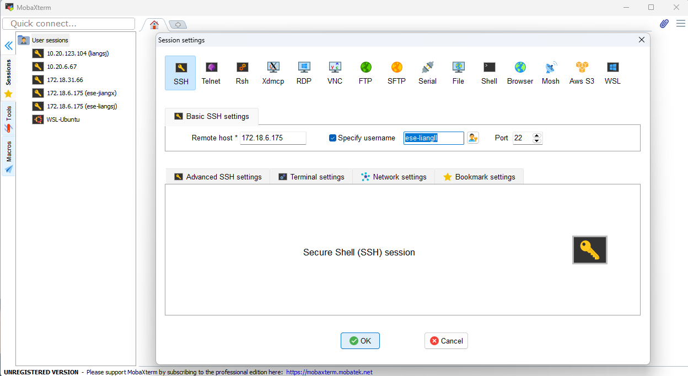
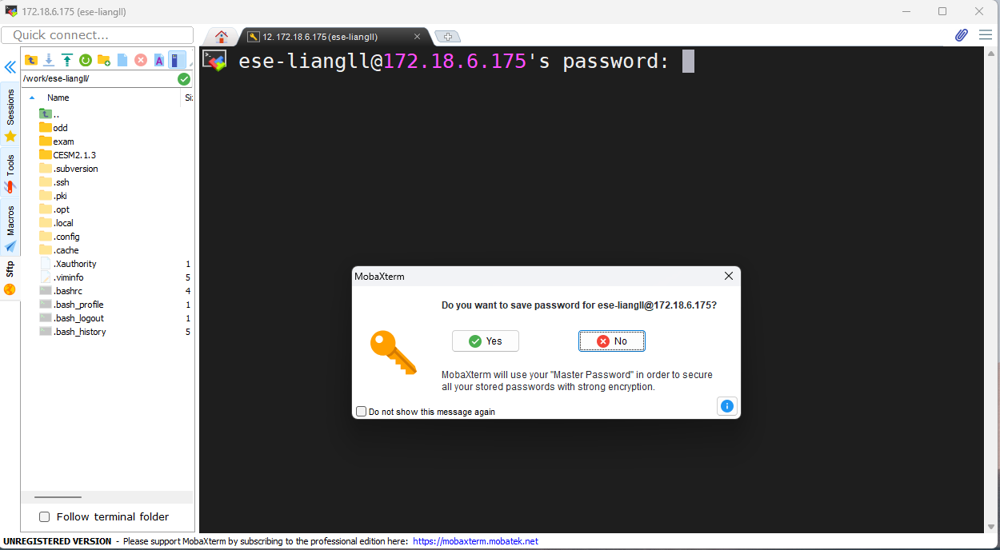
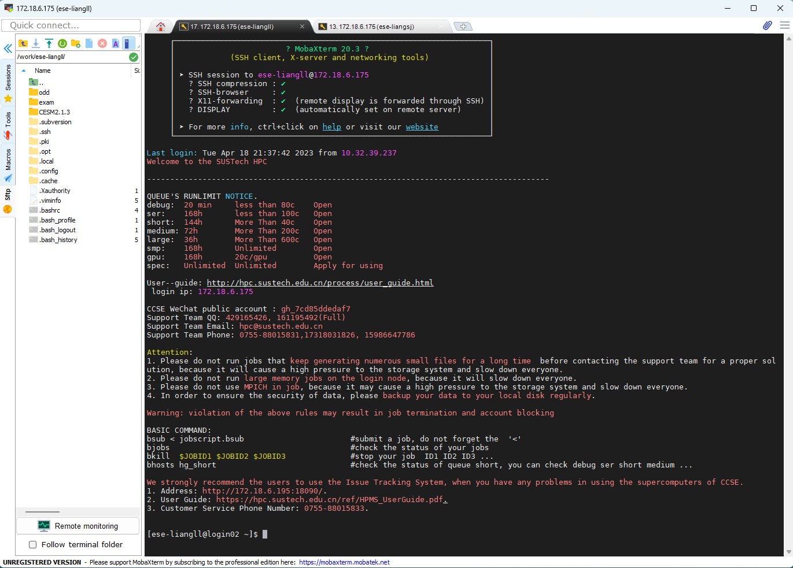
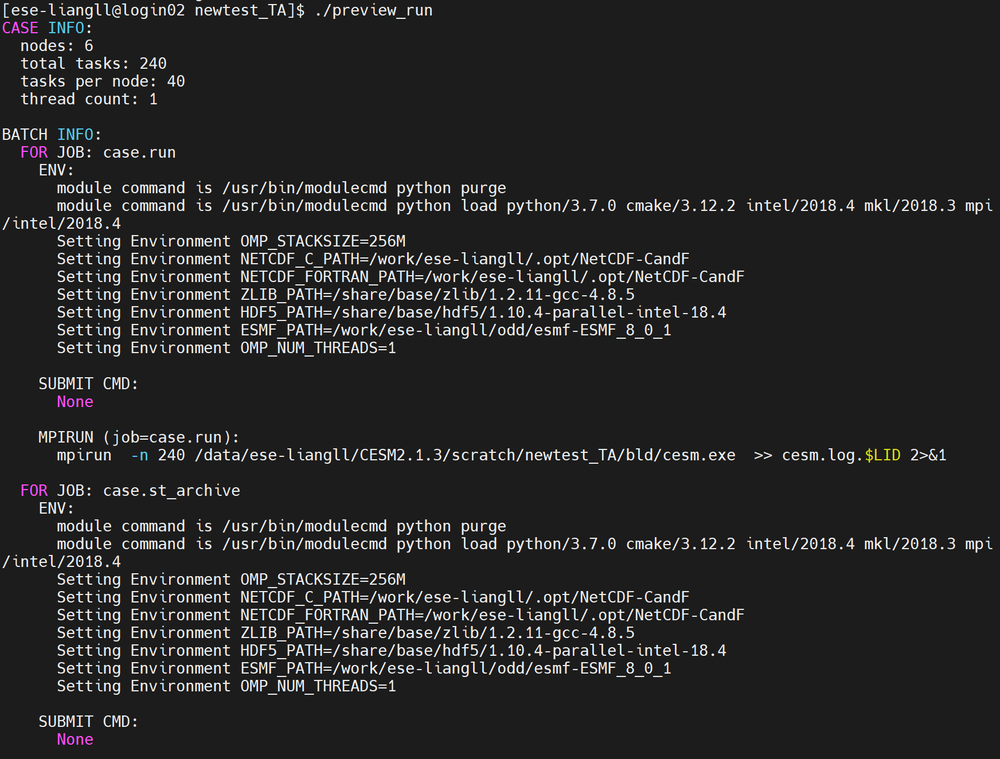
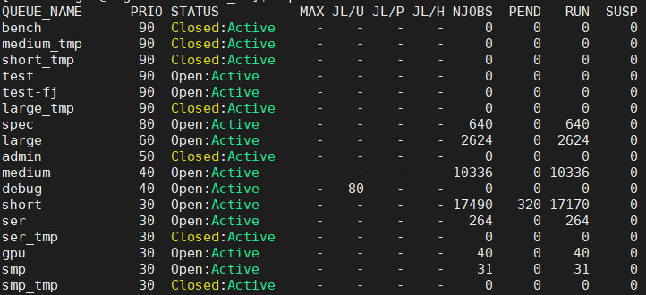
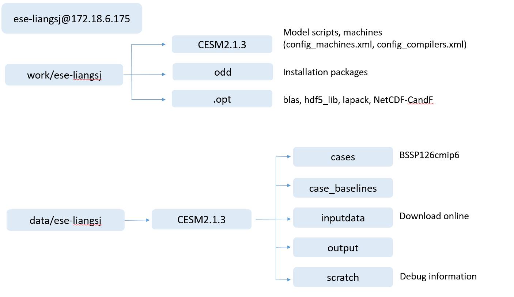

Website page:  
layout: page
title: "CESM2-worknotes"
permalink: /CESM2-tutorial/

-----------------

# CESM2 Tutorial

Step 1. Connect to Taiyi Supercomputer
=======

## Process 1. Download [MobaXterm](https://mobaxterm.mobatek.net/download.html) for Windows
Download link: https://mobaxterm.mobatek.net/download.html

## Process 2. Open MobaXterm and start a new session

> "User sessions" (right click) -> "New session"

> In Session settings:
> - Click SSH  
> - Remote host: 172.18.6.175 (172.18.6.178)  
> - Specify username: ese-liangll

> - Press OK  
> - Copy and Paste password (You won’t see the password on the screen)

>- Press either Yes/No

Note: If you failed at this step, please delete this session and start from Step. 2 to create a new session.

**If you see it as below, congrats, you have successfully connect to Taiyi supercomputer!**

For more information on Taiyi, please refer to [hpc.sustech.edu.cn](https://hpc.sustech.edu.cn/process/user_guide.html)  
LINK: https://hpc.sustech.edu.cn/process/user_guide.html

Step 2. Let's run CESM2
=======

## Porcess 1. Create a case

>\[ese-liangll@login02 ~]$>cd /work/ese-liangll/CESM2.1.3/my_cesm_sandbox/cime/scripts/

>\[ese-liangll@login02 scripts]$ ./create_newcase --case /data/ese-liangll/CESM2.1.3/cases/newtest_TA --compset FHIST --res f09_g17 --mach sustechliangll

Note: you need to rename your folder such as “newtest_xxx” (do not have any blank space in your folder name)

## Process 2. Set up a case
>\[ese-liangll@login02 scripts]$ cd /data/ese-liangll/CESM2.1.3/cases/newtest_TA/

>\[ese-liangll@login02 newtest_TA]$ ./xmlchange STOP_OPTION=nmonths,STOP_N=4

>\[ese-liangll@login02 newtest_TA]$ ./case.setup

## Process 3. Build a case
>\[ese-liangll@login02 newtest_TA]$ ./case.build

## Process 4. Run a case
Note: make sure to read [taiyi user manual]( https://hpc.sustech.edu.cn/ref/taiyi_User_Manual_v0.6.pdf) and attend training as a beginner.  
Manual:  https://hpc.sustech.edu.cn/ref/taiyi_User_Manual_v0.6.pdf

Do preview run to check the requirement to run the case.
>\[ese-liangll@login02 newtest_TA]$ ./preview_run

>\[ese-liangll@login02 newtest_TA]$ vi run_newtest_TA.sh

Type the following statements. Note: you may need to change the case name with your own.

>bsub -J newtest_TA -q short -n 140 -R "span[ptile=40]" -W 12:00 -o stdout_%J.out -e stderr_%J.err ./case.submit

>\[ese-liangll@login02 newtest_TA]$ chmod 740 run_newtest_TA.sh
>\[ese-liangll@login02 newtest_TA]$ ./run_newtest_TA.sh

**Now you have submit the job and CESM2 should be running after waiting in the queue.**

Note: Check the queue using bqueues
>\[ese-liangll@login02 newtest_TA]$ bqueues

Note: Check the queue using bqueues
>\[ese-liangll@login02 newtest_TA]$ bjobs

# Additional information
CESM model structure on Taiyi

Additional information on CESM2 
- Model Official Website: https://www.cesm.ucar.edu/models/cesm2
- Quick Start: https://escomp.github.io/CESM/versions/cesm2.1/html/
- Component set: https://www2.cesm.ucar.edu/models/cesm2/config/2.1.3/compsets.html
- Debug platform DiscussCESM: https://bb.cgd.ucar.edu/cesm/

Model infrastructure and technical notes
- Land component CLM5.0: https://escomp.github.io/ctsm-docs/versions/release-clm5.0/html/tech_note/Introduction/CLM50_Tech_Note_Introduction.html
- Atmosphere component CAM6.0: https://ncar.github.io/CAM/doc/build/html/index.html

Contact info.: liangsj2021@mail.sustech.edu.cn
