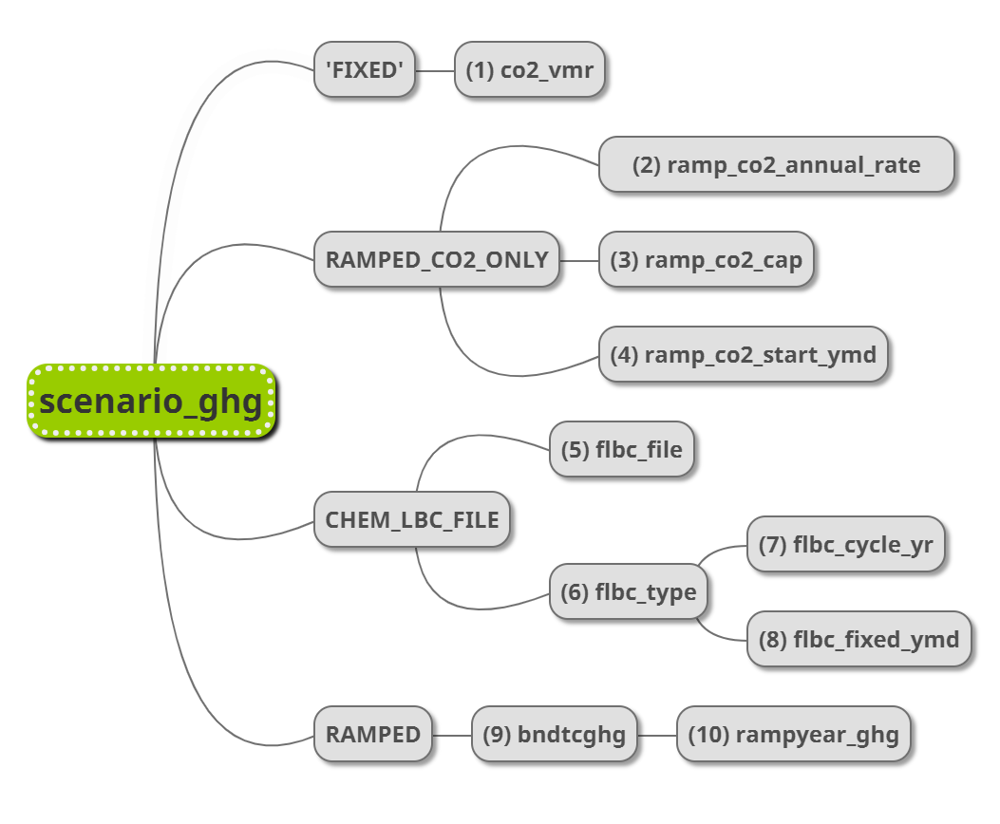

layout: page
title: "CESM2-worknotes"
permalink: /CESM2-worknotes/

CESM work notes
===============

## How to change CO2 in fully-coupled CESM2
### 
Table of contents

### 
1. Basic Variables

### 
2. Case studies

[//]:# (B1850 case)
[//]:# (B1PCT case)
[//]:# (BCO2x4 case)
[//]:# (BHIST_BDRD case)
[//]:# (BHIST_BPRP case)

## 1. Basic Variables
------------
Understand basic variables specified in env_run.xml and user_nl_clm namelists. Users are suggested to change variables ONLY in user_nl_clm.

## (1) Variables in env_run.xml
Variables in env_run.xml are related to the compset and changing them directly alter the case build process.

### a. **CCSM_BGC** 
<table><tr><td bgcolor=lightblue>Exchange of surface upward flux of CO2 among atm, lnd, ocn</td></tr></table>

>valid_values: none,CO2A,CO2B,CO2C

- CO2A:
    - sets the driver namelist variable flds_co2a = .true.
    - **prognostic/diagnostic** CO2 at the lowest model level to be sent from the atmosphere to the land and ocean.  

- CO2B:
    - flds_co2b = .true.
    - **prognostic/diagnostic** CO2 at the lowest model level to be sent from the atmosphere just to the land, and the **surface upward flux of CO2** to be sent from the land back to the atmosphere 

- CO2C:
    - flds_co2c = .true.
    - **prognostic/diagnostic** CO2 at the lowest model level to be sent from the atmosphere to the land and ocean, and the **surface upward flux of CO2** to be sent from the land and the open ocean back to the atmosphere.

### b. **CCSM_CO2_PPMV** 
<table><tr><td bgcolor=gold>Note: DO NOT change in env_xml.</td></tr></table>
<table><tr><td bgcolor=lightblue>Mechanism for setting the CO2 value in ppmv for CLM if CLM_CO2_TYPE is constant; or for POP if OCN_CO2_TYPE is constant</td></tr></table>  

>entry id="CCSM_CO2_PPMV" value="284.7"

### c. **CLM_CO2_TYPE**
<table><tr><td bgcolor=gold>Note: DO NOT change in env_xml.</td></tr></table>

>valid_values:constant, diagnostic, prognostic

- Determines how CLM will determine where CO2 is set.
    - If value is [**constant**, it will be set to **CCSM_CO2_PPMV**](#b.-CCSM_CO2_PPMV)
    - If value is either **diagnostic/prognostic**, the atmosphere model MUST send it to CLM.
    - CLM_CO2_TYPE is **normally set by the specific compset**, since it HAS to be coordinated with settings for the atmospheric model.

### d. **OCN_CO2_TYPE**
<table><tr><td bgcolor=gold>Note: DO NOT change in env_xml.</td></tr></table>

>valid_values: constant, prognostic, diagnostic, box_atm_co2
    
## (2) Variables specified in user_nl_cam
Users are suggest to make modifications in user_nl_cam. For the more details, please refer to:
[CAM6.3 Namelist Definitions](#https://docs.cesm.ucar.edu/models/cesm2/settings/current/cam_nml.html)

### **Catogories: CO2_cycle**
Variables under the catogory CO2_cycle, related to whether surface emissions of anthropogenic CO2 will be passed to the atmosphere.

### a. co2_flag  

|Entry type|Valid values|
|---       |---         |
|logical   |.true.  .false. |
>- If TRUE turn on CO2 code.
>- Default: set by build-namelist

### b. co2_cycle_rad_passive  

|Entry type|Valid values|
|---       |---         |
|logical   |.true.  .false. |

>- Flag to set rad_climate variable so that the **prognostic CO2** controlled by the co2_cycle module is **radiatively passive**.
>- Defalt: **FALSE**

### c. co2_readflux_fuel & co2flux_fuel_file

|Entry type|Valid values|
|---       |---         |
|logical   |.true.  .false. |

>- If TRUE read co2 fuel flux from file. File path specificed in co2flux_fuel_file  
>- (e.g.) atm/cam/ggas/emissions-cmip6_CO2_anthro_surface_175001-201512_fv_1.9x2.5_c20181011.nc
>- Default: set by build-namelist

### d. co2_readflux_aircraft & aircraft_co2_file

|Entry type|Valid values|
|---       |---         |
|logical   |.true.  .false. |

>- If TRUE read co2 aircraft flux from file. File path specificed in aircraft_co2_file.  
>- (e.g.) atm/cam/ggas/emissions-cmip6_CO2_anthro_ac_175001-201512_fv_0.9x1.25_c20181011.nc

### e. co2_read_flux_ocn & co2flux_ocn_file

|Entry type|Valid values|
|---       |---         |
|logical   |.true.  .false. |

>- If TRUE read co2 ocn flux from file. File path specificed in co2flux_ocn_file.  
>- Default: **FALSE**

### **Catogories: ghg_cam**
Variables under ghg_cam associate with how CO2 concentration will change in the atmosphere. If you are going to change CO2 concentration, modifications are expected here.

### a. nlte_limit_co2

|Entry type|Valid values|
|---       |---         |
|logical   |.true.  .false. |

>- If TRUE apply **upper limit to CO2 concentrations** passed to the Formichev non-LTE cooling calculation
(code not intended for values greater than 720 ppmv).
>>Running with flag set to TRUE could lead to
incorrect cooling rates if model CO2 exceeds 720 ppmv.
>- If FALSE simulation will abort if CO2 levels
exceed this value at altitudes above 1 mbar.
>>The 720 ppmv CO2 limiter in the Formichev non-LTE cooling scheme is applied to all vertical levels regardless of this setting.
Default: FALSE

### b. scenario_ghg
<table><tr><td bgcolor=palegoldenrod>Controls PRESRIBED CO2, CH4, N2O, CFC11, CFC12 volumn mixing ratios.</td></tr></table>

|Entry type|Valid values|
|---       |---         |
|char*16   |'FIXED' 'RAMPED' 'RAMP_CO2_ONLY' 'CHEM_LBC_FILE'|

>- **FIXED**: fixed mixing ratios and have default or namelist input values  
>- **RAMPED**: volumn mixing ratios are time interpolated from [bndtvghg](#bndtcghg)
>- **RAMP_CO2_ONLY**: only CO2 mixing ratios are ramped at a rate determined by  [ramp_co2_annual_rate](#ramp_co2_annual_rate), [ramp_co2_cap](#ramp_co2_cap), [ramp_co2_start_ymd](#ramp_co2_start_ymd)
>- **CHEM_LBC_FILE**: volumn mixing ratios are set from the chemistry lower boundary conditions dataset specified by [flbc_file](#flbc_file)
>- Default: set by build-namelist

**FIXED**
When atmosphere CO2 concentration is a fixed value:

### (1) co2vmr

|Entry type|Possible default values|
|---       |---         |
|real      |367.0e-6    |

>- CO2 volume mixing ratio. This is used as the [***time invariant surface value***](#b.-CCSM_CO2_PPMV) of CO2 if no time varying values are specified.  
>- Default: set by build-namelist
>- [scenario_ghg='FIXED'](#Catogories:-ghg_cam)

**RAMPED_CO2_ONLY**
Apply to 1pct increase CO2 experiments.

### (2) ramp_co2_annual_rate

|Entry type|Valid values|
|---       |---         |
|real      |any real    |

>- Amount of co2 ramping per year (percent).
>- Only used if scenario_ghg = 'RAMP_CO2_ONLY'  
>- Default: 1.0

### (3) ramp_co2_cap

|Entry type|Valid values|
|---       |---         |
|real      |any real    |

>- CO2 cap if > 0, floor otherwise. Specified as multiple or fraction of inital value
>- e.g., Setting to 4.0 will cap at 4x initial CO2 setting.
>- Only used if scenario_ghg = 'RAMP_CO2_ONLY'  
>- Default: boundless if ramp_co2_annual_rate > 0, zero otherwise.

### (4) ramp_co2_start_ymd

|Entry type|Valid values|
|---       |---         |
|integer   |any integer |

>- Date on which ramping of CO2 begins. The date is encoded as an integer in the form YYYYMMDD.
>- Only used if scenario_ghg = 'RAMP_CO2_ONLY'
>- Default: 0

**CHEM_LBC_FILE**
Apply to prescribed CO2 concentration experiments. CO2 concentration is specified as low boundary forcing.

### (5) flbc_file

|Entry type|Valid values|
|---       |---         |
|char*256  |any char    |

- Full pathname of dataset for fixed lower boundary conditions.
- (e.g.) atm/waccm/lb/LBC_1765-2100_1.9x2.5_CCMI_RCP60_za_RNOCStrend_c141002.nc
- Default: set by build-namelist.

### (6) flbc_type

|Entry type|Valid values|
|---       |---         |
|char*8    |'CYCLICAL' 'SERIAL' 'FIXED'|

>- Type of time interpolation for fixed lower boundary data.
>- Default: 'CYCLICAL'

### (7) flbc_cycle_yr

|Entry type|Valid values|
|---       |---         |
|integer   |any integer |

>- The cycle year of the fixed lower boundary data if flbc_type is 'CYCLICAL'.
>- Format: YYYY
>- Default: 0

### (8) flbc_fixed_ymd

|Entry type|Valid values|
|---       |---         |
|integer   |any integer |

>- The date at which the fixed lower boundary data is fixed
>if flbc_type is 'FIXED'.
>- Format: YYYYMMDD
>- Default: 0

**RAMPED**
### (9) bndtcghg

|Entry type|Valid values|
|---       |---         |
|char*256  |any char    |

>- Full pathname of time-variant boundary dataset for greenhouse gas surface values.
>- Default: set by build-namelist.
>- (e.g.) atm/cam/ggas/ghg_hist_1765-2005_c091218.nc

### (10) rampyear_ghg

|Entry type|Valid values|
|---       |---         |
|integer   |any integer |

>- If scenario_ghg is set to "RAMPED" then the greenhouse
gas surface values are interpolated between the annual average values read from the file specified by [bndtvghg](#-bndtcghg)
>- In that case, the value of this variable (> 0) fixes the year of the lower bounding value (i.e., the value for calendar day 1.0) used in the
interpolation.
>- For example, if rampyear_ghg = 1950, then the GHG surface values will be the result of interpolating between the values for 1950 and 1951 from the dataset.
>- Default: 0